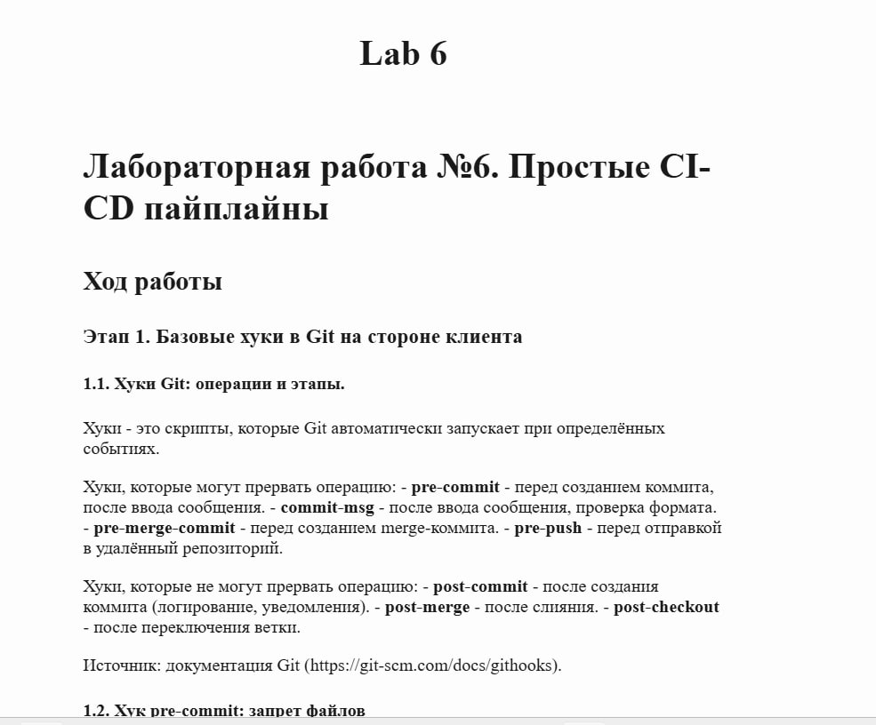
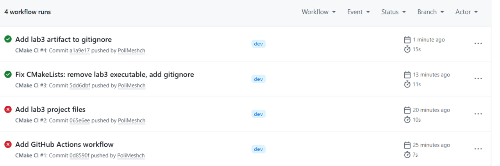

# Лабораторная работа №6. Простые CI-CD пайплайны

## Ход работы

### Этап 1. Базовые хуки в Git на стороне клиента

#### 1.1. Хуки Git: операции и этапы.
Хуки - это скрипты, которые Git автоматически запускает при определённых событиях.

Хуки, которые могут прервать операцию:
- **pre-commit** - перед созданием коммита, после ввода сообщения.
- **commit-msg** - после ввода сообщения, проверка формата.
- **pre-merge-commit** - перед созданием merge-коммита.
- **pre-push** - перед отправкой в удалённый репозиторий.

Хуки, которые не могут прервать операцию:
- **post-commit** - после создания коммита (логирование, уведомления).
- **post-merge** - после слияния.
- **post-checkout** - после переключения ветки.

Источник: [Документация Git Hooks](https://git-scm.com/docs/githooks)

#### 1.2. Хук pre-commit: запрет файлов
Создан хук, проверяющий добавляемые файлы на наличие запрещённых паттернов. 
Я выбрала запрет на файлы `.env`, токены доступа и приватные ключи: `.env`, `.token`, `.pem`, `id_rsa`.

Файл `.git/hooks/pre-commit`:

```bash
#!/bin/sh

# Получение списка всех добавленных в индекс файлов
files=$(git diff --cached --name-only --diff-filter=ACM)

# Если файлы не добавлены
[ -z "$files" ] && exit 0

for f in $files; do
  case "$f" in
    *.env|*.token|*.pem|*id_rsa*)
      echo ">>> Ошибка: файл '$f' не может быть добавлен в репозиторий"
      exit 1
      ;;
  esac
done

exit 0
```

Сделан исполняемым: `chmod +x .git/hooks/pre-commit`.

**Тестирование:**
```bash
$ git commit -m "Test env"
>>> Ошибка: файл '.env' не может быть добавлен в репозиторий
```

#### 1.3. Хук commit-msg: проверка сообщения коммита
Создан хук, проверяющий, что сообщение коммита не пустое и начинается с заглавной буквы.

Файл `.git/hooks/commit-msg`:
```bash
#!/bin/sh

# Чтение сообщения коммита
MSG=$(cat "$1")

# Проверка, что сообщение не пустое
if [ -z "$MSG" ]; then
  echo ">>> Ошибка: сообщение коммита не может быть пустым"
  exit 1
fi

# Проверка, что первая буква заглавная
FIRST_CHAR=$(echo "$MSG" | cut -c 1)
case "$FIRST_CHAR" in
  [A-Z]) ;;
  *)
    echo ">>> Ошибка: сообщение должно начинаться с заглавной буквы"
    exit 1
    ;;
esac

exit 0
```

*Примечание:* позже хук был доработан, в проверку добавлены русские заглавные буквы `[A-ZА-ЯЁ]`.
Проверено тестовым коммитом с кириллицей - работает корректно.

Сделан исполняемым: `chmod +x .git/hooks/commit-msg`.

**Тестирование:**
```bash
$ git commit -m "test message"
>>> Ошибка: сообщение должно начинаться с заглавной буквы

$ git commit -m "Test message"
[lab6-report 07ac112] Test message
 1 file changed, 1 insertion(+)
 create mode 100644 test.txt
```


### Этап 2. Хуки Git на стороне сервера

#### 2.1. Конвертация Markdown в HTML
Для конвертации Markdown в HTML установлена утилита Pandoc. Она принимает `.md`-файл и 
генерирует HTML-страницу. Флаг `-s` создаёт полноценный HTML-документ с заголовком, 
`--metadata title` задаёт название страницы.

Установка:

```bash
sudo apt install pandoc
```

Пример конвертации: `pandoc -s report.md -o report.html --metadata title="Название"`.

Источник: [Официальный сайт Pandoc](https://pandoc.org/)

#### 2.2. Создание копии репозитория и настройка remote
Создана локальная копия репозитория, добавлена как удалённый репозиторий `server`:

```bash
git clone dt-example dt-example-copy
cd dt-example
git remote add server ../dt-example-copy
```

В копии разрешён push в текущую ветку:

```bash
cd ../dt-example-copy
git config receive.denyCurrentBranch updateInstead
```

#### 2.3. Настройка хука post-receive
В копии репозитория создан хук `.git/hooks/post-receive`:

```bash
#!/bin/sh

while read oldrev newrev refname; do
    if [ "$refname" = "refs/heads/lab6-report" ]; then
        cd "/mnt/c/Users/darel/dt-example-copy"
        git checkout -f lab6-report
        pandoc -s reports/lab6.md -o reports/lab6.html --metadata title="Lab 6"
        echo ">>> HTML обновлён: reports/lab6.html"
    fi
done

exit 0
```

Сделан исполняемым: `chmod +x .git/hooks/post-receive`.

#### 2.4. Проверка работы
Выполнен коммит и пуш в `server`:

```bash
cd /mnt/c/Users/darel/dt-example
git add reports/lab6.md
git commit -m "Added lab6 report"
git push server lab6-report
```

Вывод:

```
[lab6-report 4b8cf53] Added lab6 report
 1 file changed, 173 insertions(+)
 create mode 100644 reports/lab6.md
Enumerating objects: 6, done.
Counting objects: 100% (6/6), done.
Writing objects: 100% (4/4), 2.42 KiB | 137.00 KiB/s, done.
Total 4 (delta 2), reused 0 (delta 0), pack-reused 0
remote: >>> HTML обновлён: reports/lab6.html
To ../dt-example-copy
   38cf46c..4b8cf53  lab6-report -> lab6-report
```

Хук отработал, HTML-файл создан. Файл `reports/lab6.html` открыт в браузере - отображается корректно:




### Этап 3. Сборка с помощью CMake

#### 3.1. Основные понятия CMake
CMake - система генерации файлов сборки. Основные конструкции:

- `project()` - определение проекта.
- `add_library()` - создание библиотеки.
- `add_executable()` - создание исполняемого файла.
- `target_link_libraries()` - линковка библиотек.
- `target_include_directories()` - добавление путей к заголовкам.
- `enable_testing()` и `add_test()` - настройка тестов.
- `add_subdirectory()` - подключение поддиректорий.

Источник: [Документация CMake](https://cmake.org/documentation/)

#### 3.2. Переписывание сборки lab3 на CMake
Проект лабораторной работы №3 переписан с Make на CMake.

**Корневой `CMakeLists.txt`:**

```cmake
cmake_minimum_required(VERSION 3.15)
project(Lab3 VERSION 1.0 LANGUAGES CXX)

set(CMAKE_CXX_STANDARD 17)
set(CMAKE_CXX_STANDARD_REQUIRED ON)

add_library(mylib STATIC
    src/my_string.cpp
    src/matrix.cpp
    src/worker_db.cpp
    src/notification.cpp
    src/notification_queue.cpp
    src/notification_priority_queue.cpp
    src/bool_array.cpp
    src/basefile.cpp
)

target_include_directories(mylib PUBLIC ${CMAKE_CURRENT_SOURCE_DIR}/src)

add_executable(lab3 src/lab3.cpp)
target_link_libraries(lab3 PRIVATE mylib)

enable_testing()
add_subdirectory(tests)
```

**`tests/CMakeLists.txt`:**

```cmake
add_executable(test_notification_priority_queue test_notification_priority_queue.cpp)
target_link_libraries(test_notification_priority_queue PRIVATE mylib)
add_test(NAME test_notification_priority_queue COMMAND test_notification_priority_queue
         WORKING_DIRECTORY ${CMAKE_SOURCE_DIR})
```

#### 3.3. Сборка и запуск тестов

```bash
$ cmake -S . -B build
-- The CXX compiler identification is GNU 13.3.0
-- Detecting CXX compiler ABI info - done
-- Configuring done (2.5s)
-- Generating done (0.4s)
-- Build files have been written to: .../labs/lab3/build

$ cmake --build build
[  7%] Building CXX object CMakeFiles/mylib.dir/src/my_string.cpp.o
...
[100%] Linking CXX executable test_notification_priority_queue
[100%] Built target test_notification_priority_queue

$ cd build && ctest --output-on-failure
Test project .../labs/lab3/build
    Start 1: test_notification_priority_queue
1/1 Test #1: test_notification_priority_queue ...   Passed    0.01 sec

100% tests passed, 0 tests failed out of 1
```


### Этап 4. Автоматизация задач CMake в Git

#### 4.1. Создание ветки dev

```bash
git checkout -b dev
```

#### 4.2. Хук pre-commit: прогон тестов в dev
В хук `pre-commit` добавлена проверка для ветки `dev` - запуск CMake и CTest:

```bash
BRANCH=$(git rev-parse --abbrev-ref HEAD)

if [ "$BRANCH" = "dev" ]; then
    echo ">>> Запуск тестов для ветки dev..."
    cd labs/lab3
    cmake -S . -B build 2>/dev/null
    cmake --build build 2>/dev/null
    ctest --test-dir build --output-on-failure
    if [ $? -ne 0 ]; then
        echo ">>> Тесты не пройдены. Коммит прерван."
        exit 1
    fi
    echo ">>> Тесты пройдены успешно."
    cd ../..
fi
```

#### 4.3. Хук post-commit: сборка библиотеки в dev
Создан хук `post-commit` для сборки библиотеки после коммита в `dev`:

```bash
#!/bin/sh

BRANCH=$(git rev-parse --abbrev-ref HEAD)

if [ "$BRANCH" = "dev" ]; then
    echo ">>> Сборка библиотеки для ветки dev..."
    cd labs/lab3
    cmake --build build --target mylib 2>/dev/null
    echo ">>> Библиотека собрана."
    cd ../..
fi

exit 0
```

Сделан исполняемым: `chmod +x .git/hooks/post-commit`.

#### 4.4. Тестирование обычного коммита

```bash
$ echo "// test" >> labs/lab3/src/lab3.cpp
$ git add labs/lab3/src/lab3.cpp
$ git commit -m "Test commit in dev"
>>> Запуск тестов для ветки dev...
...
>>> Тесты пройдены успешно.
>>> Сборка библиотеки для ветки dev...
[100%] Built target mylib
>>> Библиотека собрана.
[dev 3cfaa38] Test commit in dev
```

#### 4.5. Тестирование merge

```bash
$ git merge lab6-report
>>> Запуск тестов для ветки dev...
...
>>> Тесты пройдены успешно.
>>> Сборка библиотеки для ветки dev...
[100%] Built target mylib
>>> Библиотека собрана.
[dev 0ea3beb] Merge lab6-report into dev
```

Хуки работают корректно для обоих видов коммитов.


### Этап 5. Автоматизация с помощью GitHub Actions

#### 5.1. YAML
YAML - язык для конфигурационных файлов. Основной синтаксис: ключ-значение, списки через `-`, 
вложенность задаётся отступами. Поддерживает строки, числа, булевы значения, null.

Источник: [Спецификация YAML](https://yaml.org/spec/)

#### 5.2. Возможности и тарифы GitHub Actions
GitHub Actions - встроенная CI/CD-система. Позволяет запускать сборку, тестирование и деплой 
по событиям (push, pull request). Конфигурация задаётся YAML-файлами в `.github/workflows/`.

Тарифы: для публичных репозиториев - бесплатно без ограничений. Для приватных репозиториев: 
2000 минут/мес на тарифе Free, далее от $4/мес.

Источник: [Документация GitHub Actions](https://docs.github.com/en/actions)

#### 5.3. Workflow для CMake
Файл `.github/workflows/cmake.yml`:

```yaml
name: CMake CI

on:
  push:
    branches: [dev, main]
  pull_request:
    branches: [dev, main]

jobs:
  build-and-test:
    runs-on: ubuntu-latest

    steps:
      - name: Клонирование репозитория
        uses: actions/checkout@v4

      - name: Конфигурация CMake
        run: cmake -S labs/lab3 -B labs/lab3/build

      - name: Сборка проекта
        run: cmake --build labs/lab3/build

      - name: Запуск тестов
        run: ctest --test-dir labs/lab3/build --output-on-failure
```

#### 5.4. Отладка и результат
Workflow был запущен, первые два запуска завершились с ошибками:

- **Ошибка 1:** `CMakeLists.txt` не был найден - файлы проекта не были запушены в репозиторий.
- **Исправление:** добавлены `CMakeLists.txt` и исходные файлы lab3 в ветку `dev`.

- **Ошибка 2:** линковщик не нашёл `main` - в `src/` оказался объектный файл `lab3` из предыдущей сборки, который мешал линковке.
- **Исправление:** удалён объектный файл, он добавлен в корневой `.gitignore`.

После исправлений последующие запуски workflow проходят успешно.

