# Лабораторная работа №7. Развертывание на целевой машине.

*Примечание:* работа выполнена совместно с Викторией Шальных

## Ход работы

### Этап 1. Создание виртуальной машины

#### 1.1. Выбор дистрибутива.

Для выполнения 7-й работы была создана новая виртуальная машина в VirtualBox 
на основе ранее скачанного ISO-образа **KDE Neon**.

#### 1.2. Выбор платформы виртуализации.

Выбрана платформа **VirtualBox**.

#### 1.3. Потенциальные опасности.

- **Доступ к файлам** - пользователь `vika` может читать/писать в своей 
домашней директории. Без настройки прав может просматривать `/home/polina`.
- **Ресурсы системы** - возможно использование процессора для майнинга, 
запуск DoS-атак с моего IP.
- **Shared Folders** - при включённых общих папках гость получает доступ к 
файлам хостовой системы.
- **Буфер обмена** - при двунаправленном обмене можно перехватить пароли и 
данные с хоста.
- **SSH-ключи и токены** - если оставить на ВМ приватный ключ или GitHub-токен, 
напарница получит доступ к моим репозиториям.
- **VM Escape** - редкая атака, выход из песочницы гипервизора на хостовую систему.

#### 1.4. Создание виртуальной машины.

Виртуальная машина создана в VirtualBox со следующими параметрами:

- **ОЗУ:** 4096 МБ (4 ГБ)
- **Диск:** 25 ГБ
- **Процессор:** 2 ядра

Высокие параметры были выбраны не для графического интерфейса, а для 
**стабильной работы установщика KDE Neon**. При попытке использовать минимальные 
ресурсы (2 ГБ ОЗУ, 20 Гб диска, 1 ядро) процесс установки операционной системы 
зависал на этапе распаковки пакетов или не запускался вовсе. Увеличение ресурсов 
позволило успешно завершить установку.

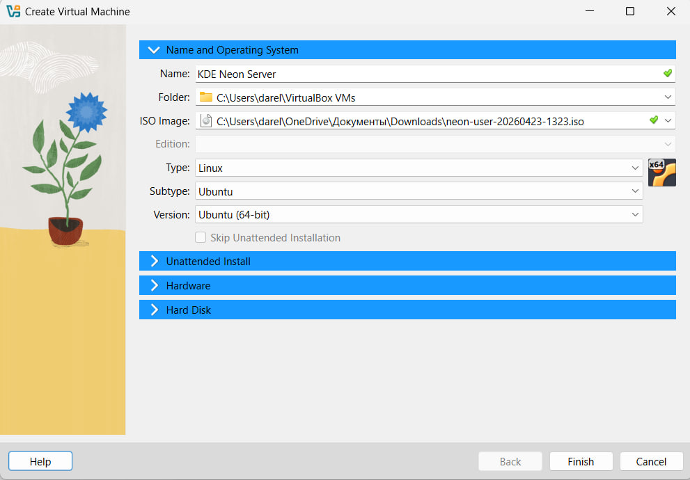

После установки системы графический интерфейс был отключён (переход в `multi-user.target`). 
Текущие параметры ВМ не уменьшались, так как они не мешают консольной работе и не требуют 
дополнительной оптимизации.

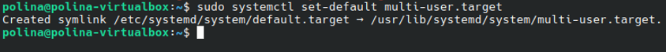


### Этап 2. Настройка удаленного доступа

#### 2.1. Установка клиента SSH.

На основном компьютере (Windows) клиент SSH уже установлен - он входит в состав Git Bash, 
который использовался на протяжении всех лабораторных работ. Для проверки доступности клиента 
была выполнена команда:

```bash
ssh -V
```

Вывод показал версию OpenSSH, что подтверждает готовность к подключениям: 

```
OpenSSH_10.2p1, OpenSSL 3.5.5 27 Jan 2026
```

#### 2.2. Настройка OpenSSH на ВМ.

**Установка OpenSSH-сервера:**

```bash
sudo apt update
sudo apt install openssh-server -y
```

После установки была проверена его работа:

```bash
sudo systemctl status ssh
```

Вывод показал, что служба загружена, но не активна (inactive (dead)):

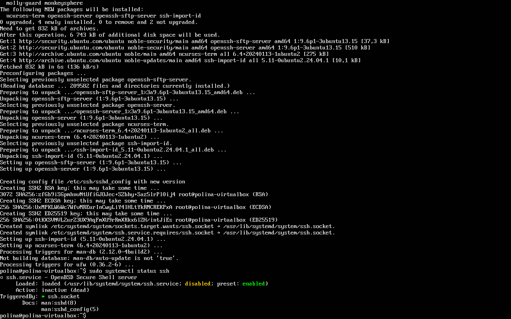

Это связано с тем, что в некоторых конфигурациях SSH-сервер не запускается автоматически 
после установки, особенно при минимальной установке или после отключения графики.

Для немедленного запуска и включения автозапуска была выполнена команда:

```bash
sudo systemctl enable --now ssh
```

После этого повторная проверка статуса показала active (running), что подтвердило корректную работу сервера:

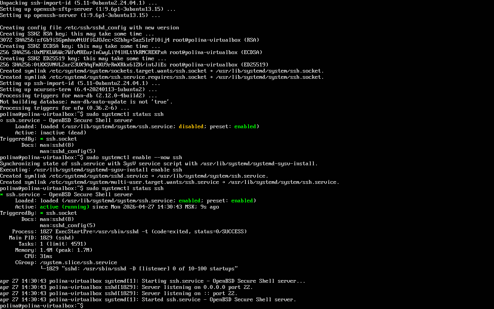

#### 2.3. Понятия порта TCP и проброса портов.

**Порт TCP** — числовой идентификатор (0–65535), который вместе с IP-адресом определяет службу на машине. 
SSH использует порт 22.

**Проброс портов** — механизм перенаправления пакетов с порта одного узла на порт другого. 
В VirtualBox при NAT гостевая ВМ не видна извне. Проброс позволяет подключиться к порту хоста и 
быть перенаправленным на порт ВМ.

#### 2.4. Настройка проброса портов.

В настройках VirtualBox: Сеть → Адаптер 1 (NAT) → Дополнительно → Проброс портов. 

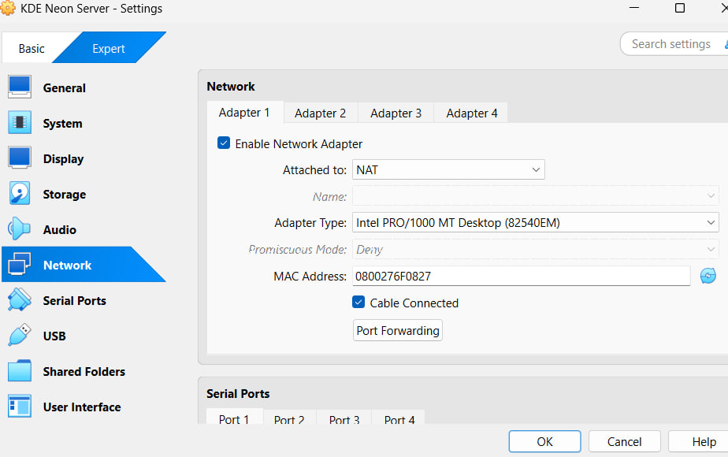

Добавлено правило:

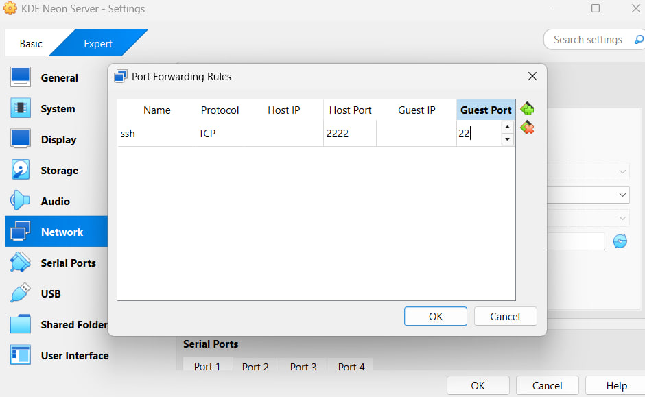

- Имя: `ssh`
- Протокол: `TCP`
- Порт хоста: `2222`
- Порт гостя: `22`

Подключение с хоста по паролю:

```bash
ssh -p 2222 polina@localhost
``` 

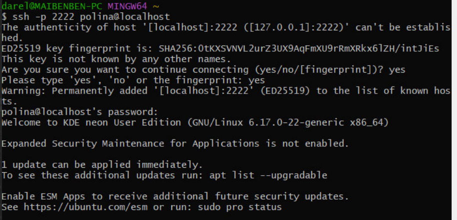

#### 2.5. Добавление публичного ключа.

**Принцип:** на клиенте генерируется пара ключей (приватный + публичный). 
Публичный ключ копируется на сервер в `~/.ssh/authorized_keys`. 
Сервер проверяет, что клиент владеет приватным ключом.

Генерация ключа на хосте:

```bash
ssh-keygen -t rsa -b 4096
```

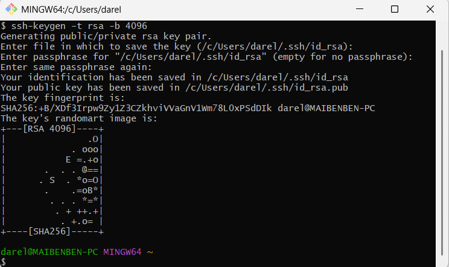

Копирование ключа на ВМ:

```bash
ssh-copy-id -p 2222 polina@localhost
```

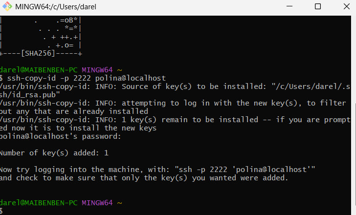

#### 2.6. Подключение без пароля.

```bash
ssh -p 2222 polina@localhost
```

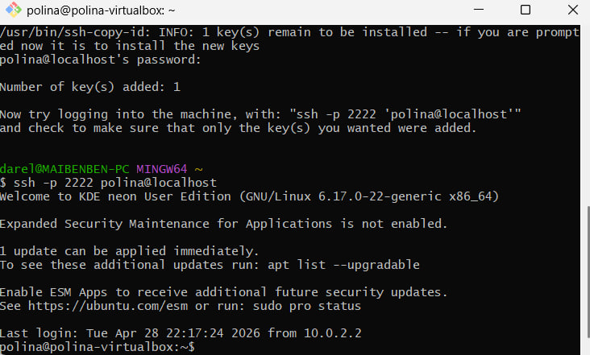

Пароль не запрашивается.

##### 2.7. Отключение доступа по паролю.

Редактирование `/etc/ssh/sshd_config`:

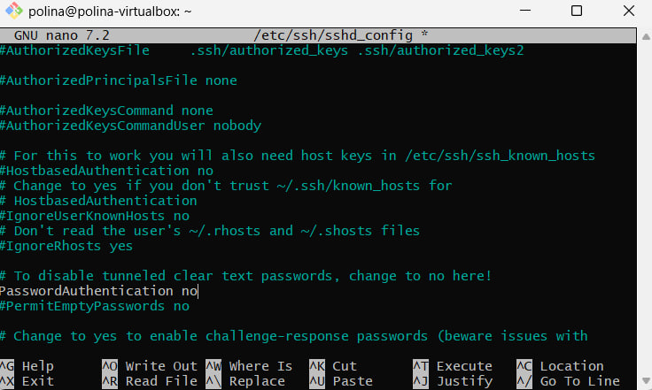

Был сделан перезапуск службы:

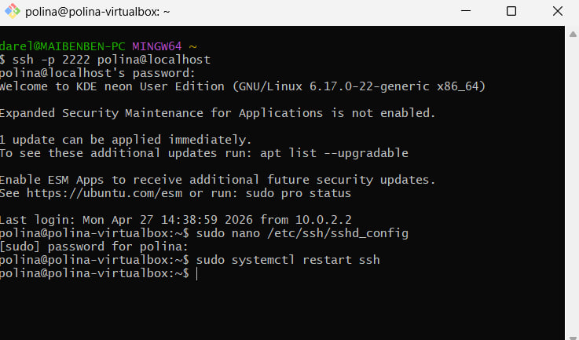

Проверка:

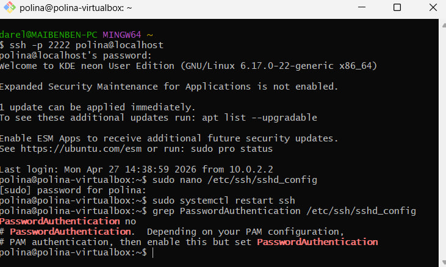


### 3. Настройка сессии для другого пользователя

#### 3.1. Добавление пользователя.

На ВМ создан пользователь для Вики:

```bash
sudo useradd -m -s /bin/bash vika
sudo passwd vika
```

*Примечание:* флаг `-m` создаёт домашнюю директорию `/home/vika`, `-s /bin/bash` задаёт оболочку.

Проверка:

```bash
id vika
```

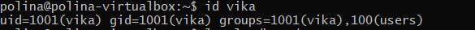

#### 3.2. Получение публичного ключа напарника.

Вика передала содержимое файла `~/.ssh/id_ed25519.pub`. 
Ключ добавлен в authorized_keys пользователя vika:

```bash
sudo mkdir -p /home/vika/.ssh
sudo nano /home/vika/.ssh/authorized_keys
```

В открывшийся файл вручную вставлен публичный ключ напарницы. После добавления настроены права:

```bash
sudo chown -R vika:vika /home/vika/.ssh
sudo chmod 700 /home/vika/.ssh
sudo chmod 600 /home/vika/.ssh/authorized_keys
```

#### 3.3. Общая локальная сеть.

Оба компьютера подключены к одной точке доступа Wi-Fi (раздача с телефона).

#### 3.4. Определение IP и проверка доступности.

IP-адрес хостовой машины в локальной сети узнан командой в cmd:

   ```cmd
   ipconfig
   ```

   Напарница проверила доступность командой:

   ```cmd
   ping <IP-адрес хоста>
   ```

   Пакеты доходят успешно:

   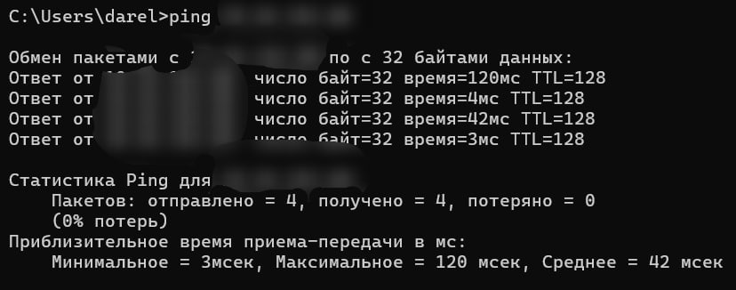

#### 3.5. Открытие и закрытие порта.

На Windows порты управляются через **Брандмауэр Windows** (Windows Defender Firewall). 
Открыть и закрыть порт можно через командную строку (cmd) от имени администратора:

```cmd
# Открыть порт
netsh advfirewall firewall add rule name="SSH-2222" dir=in action=allow protocol=TCP localport=2222

# Закрыть (удалить правило) после окончания
netsh advfirewall firewall delete rule name="SSH-2222"
```

#### 3.6. Временное открытие порта и подключение.

После настройки брандмауэра и открытия порта 2222 подключения были выполнены с обеих сторон.

**Моё подключение к ВМ напарницы:**

```bash
ssh -p 2222 Polina@<IP-адрес хоста>
```

Подключение прошло успешно:

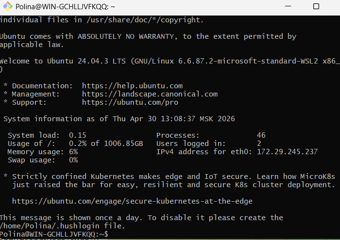

**Подключение напарницы к моей ВМ:**

```bash
ssh -p 2222 vika@<IP-адрес хоста>
```

Подключение также прошло успешно.

После завершения работы правило брандмауэра удалено командой:

```cmd
netsh advfirewall firewall delete rule name="SSH-2222"
```


### Этап 4. Развертывание программы

#### 4.1. Необходимые компоненты на стороне напарника.

Для того чтобы мой код можно было склонировать, собрать и протестировать, 
на виртуальной машине напарницы потребовались следующие программы:

- Git (для загрузки репозитория)
- GCC/G++ (компиляторы C++)
- CMake (система сборки)
- Make (автоматизация сборки)

Она установила их одной командой:

```bash
sudo apt install -y git build-essential cmake
```

#### 4.2. Подключение и работа с репозиторием.

Я подключилась к ВМ напарницы через SSH:

```bash
ssh -p 2222 Polina@<IP-адрес>
```

Доступ к приватному репозиторию организован через токен GitHub (вместо передачи 
приватного ключа, так как ключ даёт неограниченный доступ к аккаунту и не должен 
покидать мою машину). Токен использовался как пароль при клонировании:

```bash
git clone https://github.com/PoliMeshch/dt-example.git
```

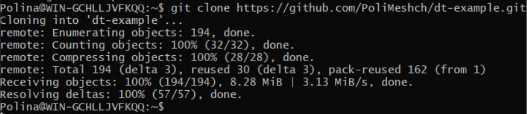

#### 4.3. Сборка и тестирование на удалённой машине.

После клонирования репозитория я перешла в папку первой лабораторной работы по Структурам данных:

```bash
cd dt-example/labs/lab1
```

Затем была выполнена сборка и запуск тестов:

```bash
make test
```

В процессе сборки компилятор успешно обработал все исходные файлы, а тесты показали ожидаемый 
результат — все проверки (конструкторы, методы, операции) завершились с отметкой «OK»:

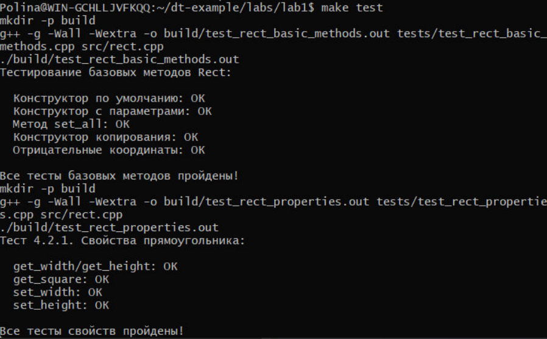

Таким образом, на удалённой машине напарника мой проект был успешно собран и протестирован. 